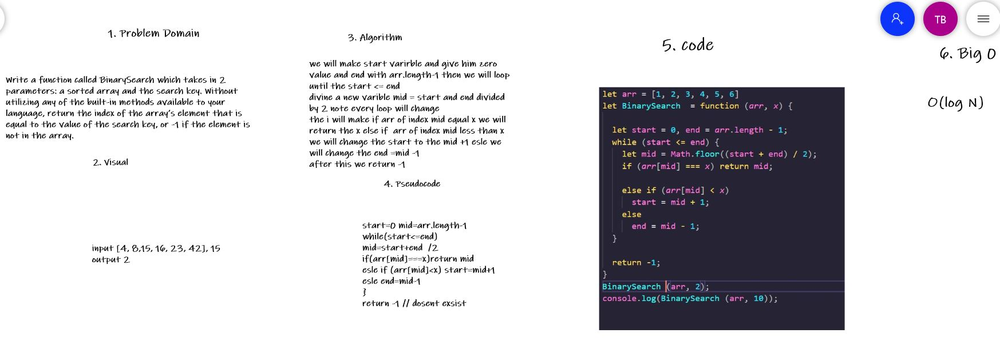

# Data Structures and Algorithms

See [setup instructions](https://codefellows.github.io/setup-guide/code-301/3-code-challenges), in the Code 301 Setup Guide.

## Repository Quick Tour and Usage

### 301 Code Challenges

Under the `javascript` folder, at the top level, is a sub-folder called `code-challenges`

Each day, you'll add one new file to this folder to do your work for the day's assigned code challenge

If you have not already done so, run `npm install` from within this folder to setup your system to be able to run tests using `Jest`

To run your tests

- Change to the `javascript` folder
- run `npm test` to run all of the tests
- run `npm test ##` to only run tests for challenge ## (i.e. 01)

### 401 Data Structures, Code Challenges

* Please follow the instructions specific to your 401 language, which can be found in the directory below, matching your course.

## Reverse an Array
Write a function called reverseArray which takes an array as an argument. Without utilizing any of the built-in methods available to your language, return an array with elements in reversed order.

## Whiteboard Process

* Visual  Input [1,2,3,4]  	Output	[4,3,2,1]
## Approach & Efficiency
we will loop throw the array from the last element to the first each loop will push  the value to a new array and it will be the reverse array

## array-insert-shift
Write a function called insertShiftArray which takes in an array and a value to be added. Without utilizing any of the built-in methods available to your language, return an array with the new value added at the middle index.

## Whiteboard Process

* Visual  Input [2,4,6,-8], 5   	Output	[2,4,5,6,-8]

## Approach & Efficiency
i will make new arr then 
i will divide the length of the array by 2 and i will put the value in indexLength  then i will loop throw the array if the index = indexLength i will push the value of index and the new value in to the new array  if not i will push the value of array index  into the new arr. 

## BinarySearch 
Write a function called BinarySearch which takes in 2 parameters: a sorted array and the search key. Without utilizing any of the built-in methods available to your language, return the index of the array’s element that is equal to the value of the search key, or -1 if the element is not in the array.
## Whiteboard Process

## Approach & Efficiency

we will make start varirble and give him zero value and end with arr.length-1 then we will loop  
until the start <= end 
divine a new varible mid = start and end divided by 2 note every loop will change
the i will make if arr of index mid equal x we will return the x else if  arr of index mid less than x we will change the start to the mid +1 esle we will change the end =mid -1
after this we return -1

## Singly Linked List
A singly linked list is a type of linked list that is unidirectional, that is, it can be traversed in only one direction from head to the last node (tail). Each element in a linked list is called a node. A single node contains data and a pointer to the next node which helps in maintaining the structure of the list.

## Challenge

you need to understand how linkedList work to be able to write functions and test

## Approach & Efficiency

LinkedList is that insertions and deletion can be done very quickly.
If you just want to insert an element right to the beginning of the LinkedList, that can be done in constant time O(1).

 
## API
* insert(value) => add value to the linkedList
* includes(value) => check if the value exist in the linkedList
* toString()=>a string representing all the values in the Linked List, formatted as:
"  a  ->  b  ->  c  -> NULL"

 
 ### table of contant

|  Assignment    |    link                                                                       |
| -----------    | ----------------                                                              |
|  readme1.md.   |[linked-list-insertions](javascript/linked-list-insertions/readme1.md)         |
|  readme2.md.   |[linked-list-kth](javascript/linked-list-kth/readme2.md)                       |
|  readme3.md.   |[linked-list-zip](javascript/linked-list-zip/readme3.md)                       |
|  readme11.md.  |[stack-queue-pseudo](javascript/stack-queue-pseudo/readme11.md)                |
|  readme12.md   |[stack-queue-animal-shelter](javascript/stack-queue-animal-shelter/readme12.md)|
|  readme13.md   |[stack-queue-brackets](javascript/stack-queue-brackets/readme13.md)|
|  readme15.md   |[trees](javascript/trees/readme15.md)|
|  readme16.md   |[maxtree](javascript/maxtree/trees/readme16.md)|
|  readme17.md   |[tree-breadth-first](javascript/tree-breadth-first/readme17.md)|
|  readme18.md   |[tree-fizz-buzz](javascript/tree-fizz-buzz/readme18.md)|
|  readme19.md   |[selectionSort](javascript/selectionSort/readme19.md)|

