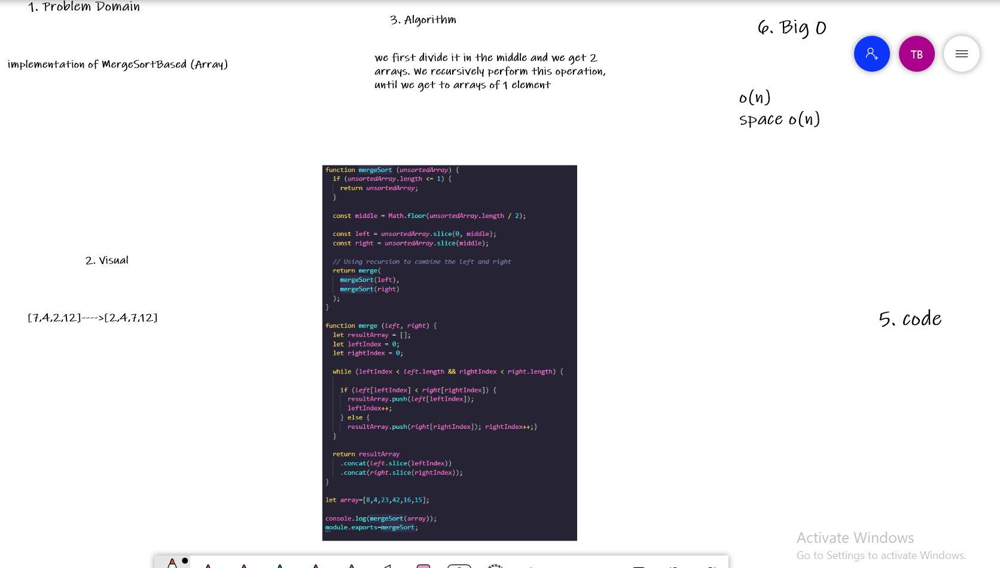

# Challenge Summary

implementation of MergeSortBased (Array)

## Whiteboard Process

## Approach & Efficiency

we first divide it in the middle and we get 2 arrays. We recursively perform this operation, until we get to arrays of 1 element.
