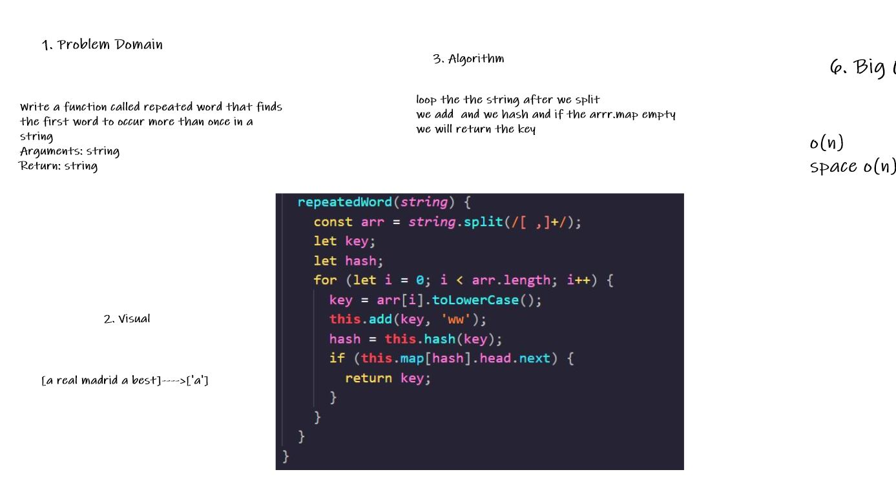

# Challenge Summary

Write a function called repeated word that finds the first word to occur more than once in a string
Arguments: string
Return: string

## Whiteboard Process

## Approach & Efficiency

loop the the string after we split 
we add  and we hash and if the arrr.map empty we will return the key