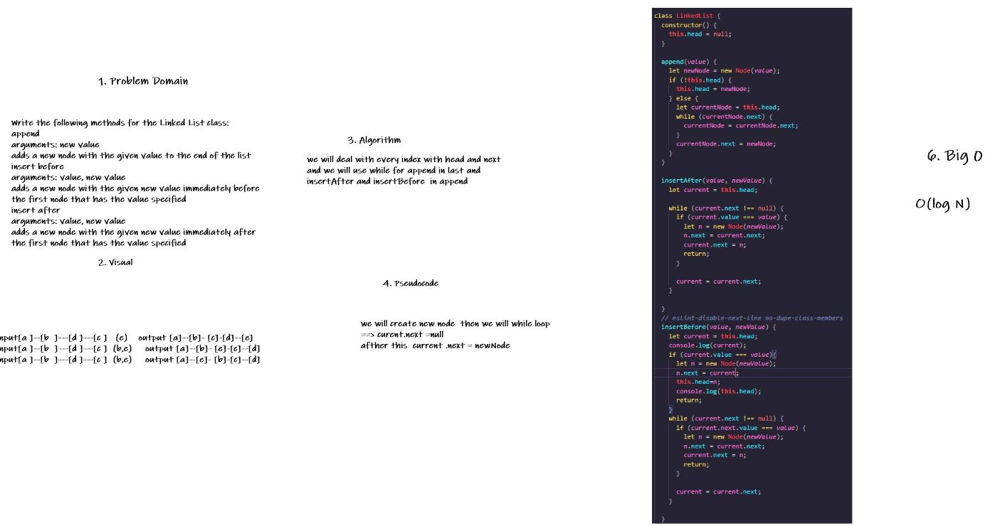

 ## Challenge Summary
Write the following methods for the Linked List class:
append
arguments: new value
adds a new node with the given value to the end of the list
insert before
arguments: value, new value
adds a new node with the given new value immediately before the first node that has the value specified
insert after
arguments: value, new value
adds a new node with the given new value immediately after the first node that has the value specified

## Whiteboard Process

## Approach & Efficiency
we will add to next of linkedlist and we will add after the value (value,nextitem) and we will add befor the value (value,prevalue)
