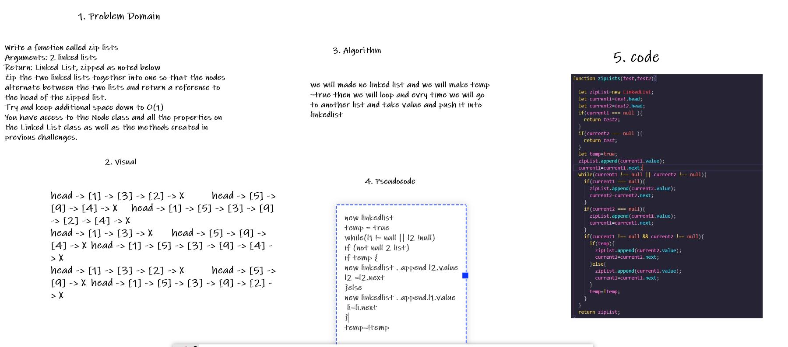

## Challenge Summary
Write a function called zip lists
Arguments: 2 linked lists
Return: Linked List, zipped as noted below
Zip the two linked lists together into one so that the nodes alternate between the two lists and return a reference to the head of the zipped list.
Try and keep additional space down to O(1)
You have access to the Node class and all the properties on the Linked List class as well as the methods created in previous challenges.

## Whiteboard Process

## Approach & Efficiency
we will made ne linked list and we will make temp =true then we will loop and evry time we will go to another list and take value and push it into linkedlist