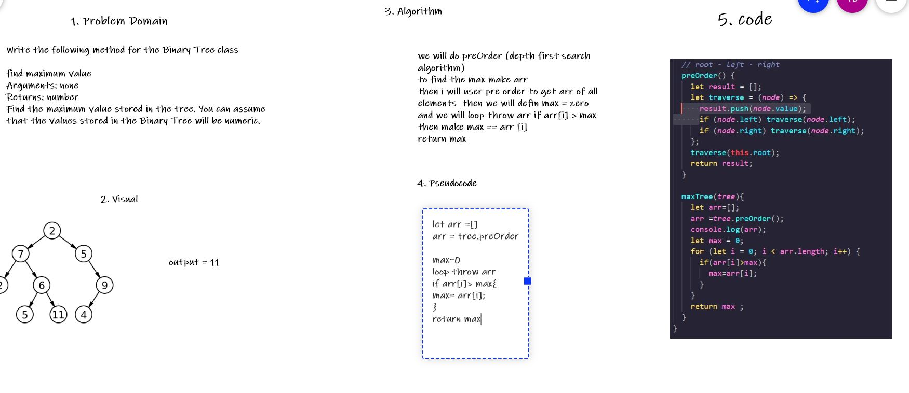

## Challenge Summary
Write the following method for the Binary Tree class

find maximum value
Arguments: none
Returns: number
Find the maximum value stored in the tree. You can assume that the values stored in the Binary Tree will be numeric

## Whiteboard Process

## Approach & Efficiency
we will do preOrder (depth first search algorithm) 
to find the max make arr
then i will user pre order to get arr of all elements  then we will defin max = zero
and we will loop throw arr if arr[i] > max
then make max == arr [i]
return max