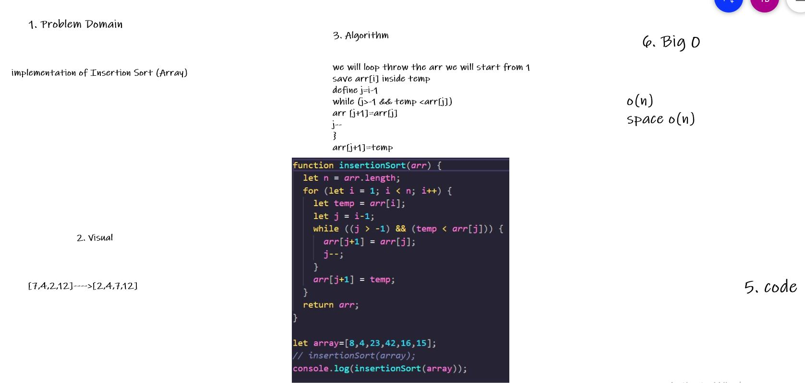

# Challenge Summary

implementation of Insertion Sort (Array)

## Whiteboard Process

## Approach & Efficiency

we will loop throw the arr we will start from 1 
save arr[i] inside temp 
define j=i-1
while (j>-1 && temp <arr[j])
arr [j+1]=arr[j]
j--
}
arr[j+1]=temp 

