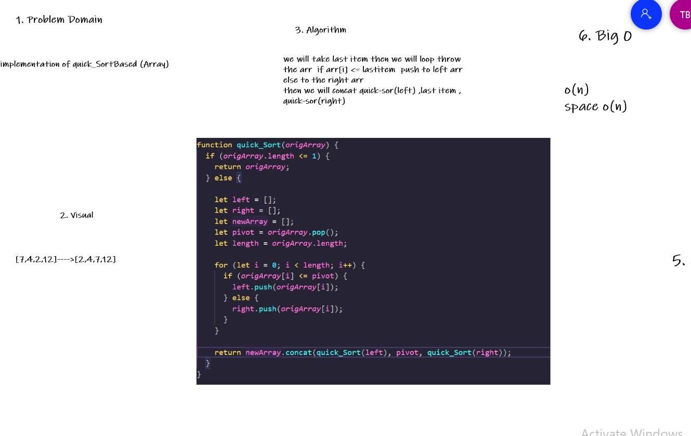

# Challenge Summary

implementation of Quick Sort based (Array)

## Whiteboard Process

## Approach & Efficiency

we will take last item then we will loop throw the arr  if arr[i] <= lastitem  push to left arr  else to the right arr then we will concat quick-sor(left) ,last item ,  quick-sor(right)
