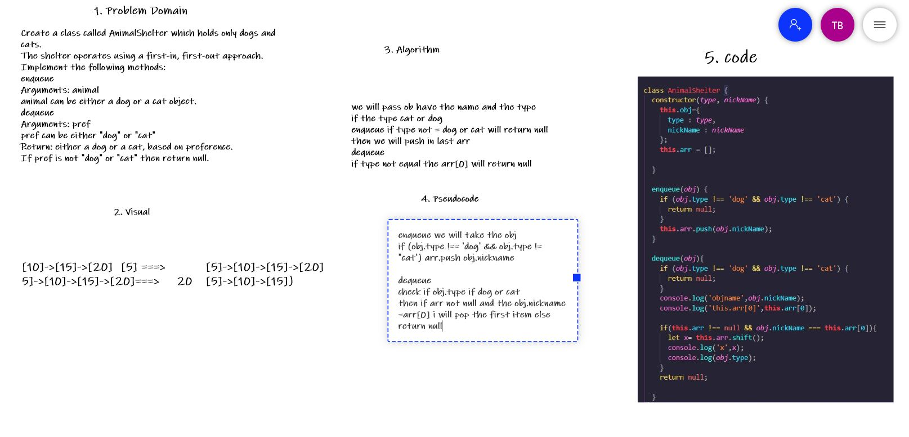

## Challenge Summary
Create a class called AnimalShelter which holds only dogs and cats.
The shelter operates using a first-in, first-out approach.
Implement the following methods:
enqueue
Arguments: animal
animal can be either a dog or a cat object.
dequeue
Arguments: pref
pref can be either "dog" or "cat"
Return: either a dog or a cat, based on preference.
If pref is not "dog" or "cat" then return null.

## Whiteboard Process

## Approach & Efficiency
we will pass ob have the name and the type 
if the type cat or dog 
enqueue if type not = dog or cat will return null 
then we will push in last arr
dequeue
if type not equal the arr[0] will return null 