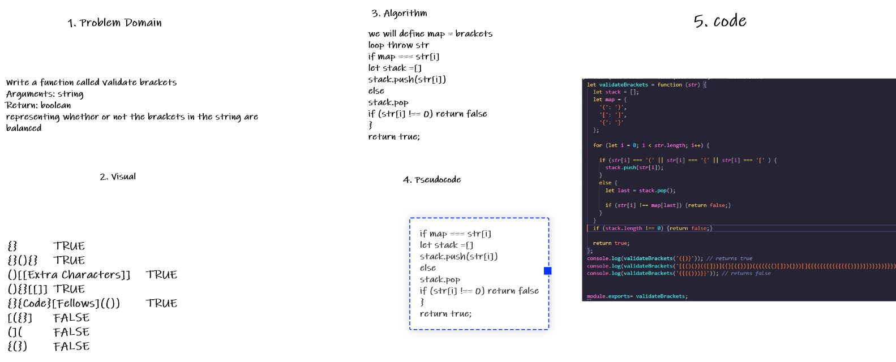

## Challenge Summary
Write a function called validate brackets
Arguments: string
Return: boolean
representing whether or not the brackets in the string are balanced
## Whiteboard Process

## Approach & Efficiency
we will define map = brackets 
loop throw str 
if map === str[i]
let stack =[]
stack.push(str[i])
else 
stack.pop
if (str[i] !== 0) return false
}
return true;