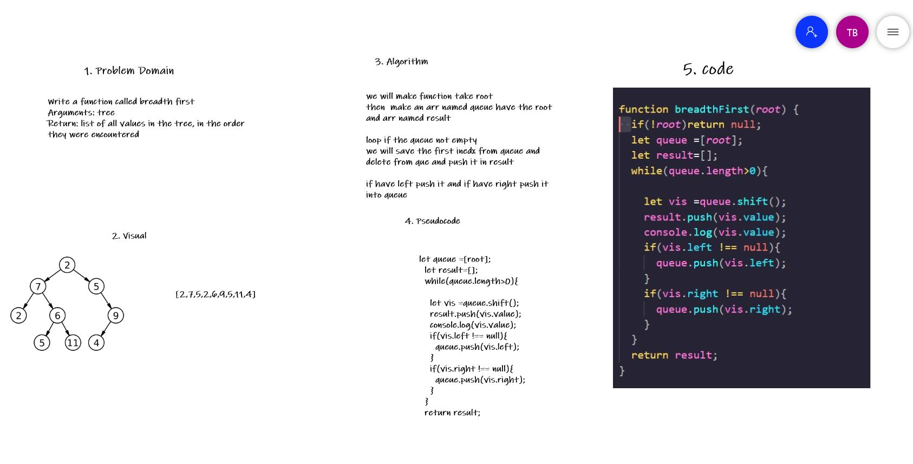

## Challenge Summary
Write a function called breadth first
Arguments: tree
Return: list of all values in the tree, in the order they were encountered

## Whiteboard Process

## Approach & Efficiency
we will make function take root 
then  make an arr named queue have the root
and arr named result 

loop if the queue not empty 
we will save the first inedx from queue and delete from que and push it in result 

if have left push it and if have right push it into queue