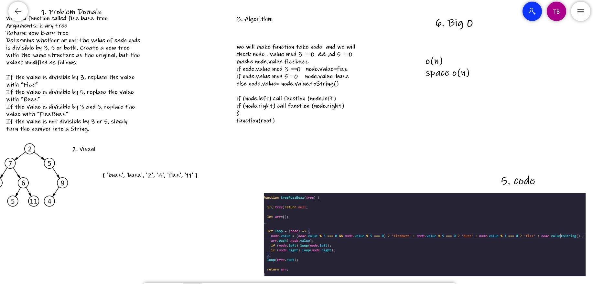

## Challenge Summary
Write a function called fizz buzz tree
Arguments: k-ary tree
Return: new k-ary tree
Determine whether or not the value of each node is divisible by 3, 5 or both. Create a new tree with the same structure as the original, but the values modified as follows:

If the value is divisible by 3, replace the value with “Fizz”
If the value is divisible by 5, replace the value with “Buzz”
If the value is divisible by 3 and 5, replace the value with “FizzBuzz”
If the value is not divisible by 3 or 5, simply turn the number into a String.

## Whiteboard Process

## Approach & Efficiency
we will make function take node  and we will check node . value mod 3 ==0  && ,od 5 ==0 
macke node.value fizzbuzz 
if node.value mod 3 ==0   node.value=fizz
if node.value mod 5==0    node.value=buzz
else node.value= node.value.toString()

if (node.left) call function (node.left)
if (node.right) call function (node.right)
}
function(root)