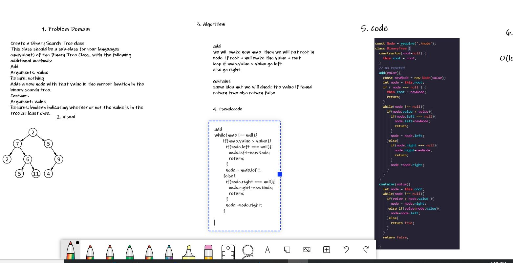

## Challenge Summary
Create a Binary Search Tree class
This class should be a sub-class (or your languages equivalent) of the Binary Tree Class, with the following additional methods:
Add
Arguments: value
Return: nothing
Adds a new node with that value in the correct location in the binary search tree.
Contains
Argument: value
Returns: boolean indicating whether or not the value is in the tree at least once.

## Whiteboard Process

## Approach & Efficiency
we will made ne linked list and we will make temp =true then we will loop and evry time we will go to another list and take value and push it into linkedlist